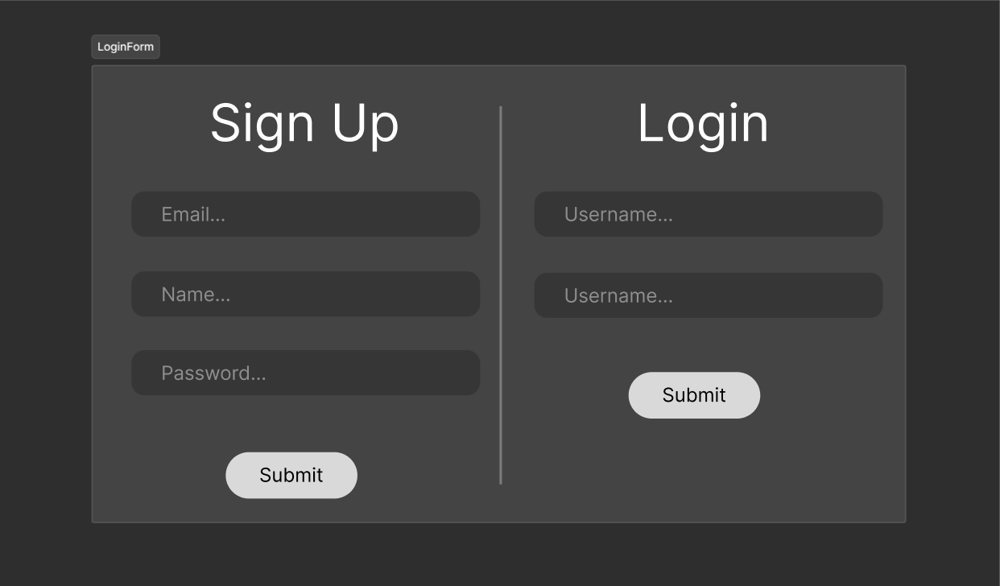
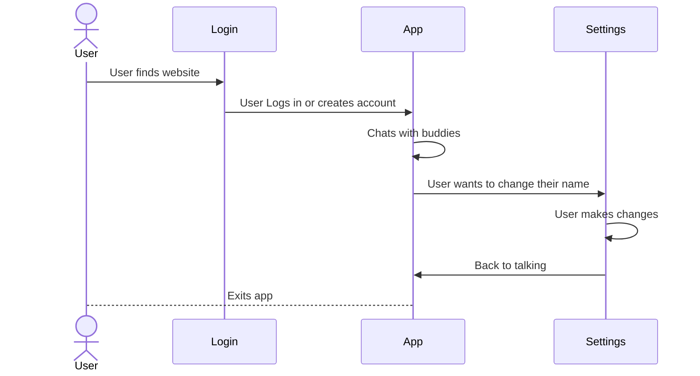

# Your startup name here

[My Notes](notes.md)

A simple, virtual chat enviroment supporting voice proximity chat meant to create nuance when collaborating with a remote team. This is the startup project for BYU's CS 260 class. _Author: Broderick Johnson_

## 🚀 Specification Deliverable

> [!NOTE]
>  Fill in this sections as the submission artifact for this deliverable. You can refer to this [example](https://github.com/webprogramming260/startup-example/blob/main/README.md) for inspiration.

For this deliverable I did the following. I checked the box `[x]` and added a description for things I completed.

- [x] Proper use of Markdown
- [x] A concise and compelling elevator pitch
- [x] Description of key features
- [x] Description of how you will use each technology
- [x] One or more rough sketches of your application. Images must be embedded in this file using Markdown image references.

### Elevator pitch

The productivity advancements that came from the agile frameworks of the 90s and early 2000s revolutionized the tech industry, but you can also say that one of it's core pillars has been depreciated. These frameworks were made for social office enviroments where engineers collaborate freely and much needed informal meetings take place. The ideal office enviroment for agile is dissapearing due to the push for remote work and the industry needs to involve. OfficeTalk is an app designed to fix this, by implementing a minimalist 2d virual room, this app allows users to talk to each other using proximity voice chat and choose where to be in the room. The app is low bandwith due to the choice to soley support voice rather than video and free from distracting visuals that other virtual office apps come with. The idea is that all employees can log in, choose who to sit close to (including evesdropping on other conversations), and get to work with the app in the background.

### Design

##### Login Screen

A simple login/signup screen with two options one on both side.

##### User Profile Screen

A settings screen for the user to change their name and avatar.

##### Application Screen

The main application screen. This is where the voice chat function exists.

### Key features

- Proximity Voice chat through WebRTC
- Profile tokens with avatars generated from initials
- Minimalistic design for minimal distractions

### Technologies

I am going to use the required technologies in the following ways.

- **HTML** - Basic divisions of app. window and form setup.
- **CSS** - Color, form centering and input field style.
- **React** - Movable profile tokens.
- **Service** - WebRTC for peer-to-peer chat.
- **DB/Login** - Profile information and passwords.
- **WebSocket** - Establishing WebRTC connection.

## 🚀 AWS deliverable

For this deliverable I did the following. I checked the box `[x]` and added a description for things I completed.

- [x] **Server deployed and accessible with custom domain name** - [My server link](https://officetalk.click).

## 🚀 HTML deliverable

For this deliverable I did the following. I checked the box `[x]` and added a description for things I completed.

- [x] **HTML pages** - I added the 3 html pages that make up my application.
- [x] **Proper HTML element usage** Most pages use headers and footers. All pages use main.
- [x] **Links** All pages are accessable from each other by using hyperlinks (they appear as buttons)
- [x] **Text** There is some text describing features in my current application.
- [x] **3rd party API placeholder** - The structure for this feature exists with a HTML comment denoting it.
- [x] **Images** - I used SVG markup to creake simple token icons.
- [x] **Login placeholder** - There is a login form structure.
- [x] **DB data placeholder** - There is structure for displaying database info.
- [x] **WebSocket placeholder** - There is structure for this and it is denoted with an HTML comment.

## 🚀 CSS deliverable

For this deliverable I did the following. I checked the box `[x]` and added a description for things I completed.

- [x] **Header, footer, and main content body** - I did not complete this part of the deliverable.
- [x] **Navigation elements** - I did not complete this part of the deliverable.
- [x] **Responsive to window resizing** - I did not complete this part of the deliverable.
- [x] **Application elements** - I did not complete this part of the deliverable.
- [x] **Application text content** - I did not complete this part of the deliverable.
- [x] **Application images** - I did not complete this part of the deliverable.

## 🚀 React part 1: Routing deliverable

For this deliverable I did the following. I checked the box `[x]` and added a description for things I completed.

- [ ] **Bundled using Vite** - I did not complete this part of the deliverable.
- [ ] **Components** - I did not complete this part of the deliverable.
- [ ] **Router** - I did not complete this part of the deliverable.

## 🚀 React part 2: Reactivity deliverable

For this deliverable I did the following. I checked the box `[x]` and added a description for things I completed.

- [ ] **All functionality implemented or mocked out** - I did not complete this part of the deliverable.
- [ ] **Hooks** - I did not complete this part of the deliverable.

## 🚀 Service deliverable

For this deliverable I did the following. I checked the box `[x]` and added a description for things I completed.

- [ ] **Node.js/Express HTTP service** - I did not complete this part of the deliverable.
- [ ] **Static middleware for frontend** - I did not complete this part of the deliverable.
- [ ] **Calls to third party endpoints** - I did not complete this part of the deliverable.
- [ ] **Backend service endpoints** - I did not complete this part of the deliverable.
- [ ] **Frontend calls service endpoints** - I did not complete this part of the deliverable.
- [ ] **Supports registration, login, logout, and restricted endpoint** - I did not complete this part of the deliverable.

## 🚀 DB deliverable

For this deliverable I did the following. I checked the box `[x]` and added a description for things I completed.

- [ ] **Stores data in MongoDB** - I did not complete this part of the deliverable.
- [ ] **Stores credentials in MongoDB** - I did not complete this part of the deliverable.

## 🚀 WebSocket deliverable

For this deliverable I did the following. I checked the box `[x]` and added a description for things I completed.

- [ ] **Backend listens for WebSocket connection** - I did not complete this part of the deliverable.
- [ ] **Frontend makes WebSocket connection** - I did not complete this part of the deliverable.
- [ ] **Data sent over WebSocket connection** - I did not complete this part of the deliverable.
- [ ] **WebSocket data displayed** - I did not complete this part of the deliverable.
- [ ] **Application is fully functional** - I did not complete this part of the deliverable.
